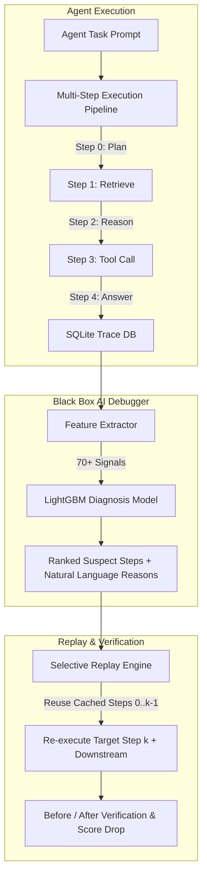

# Black Box ◼ AI-Powered Agent Trace Debugging & Replay System

Black Box is an AI-powered debugging and root-cause analysis system designed for multi-step AI agents. It learns from observable execution traces (inputs, outputs, intermediate state diffs, latency, error flags) to identify suspicious or failure-causing steps in an agent's execution sequence.

When an agent run fails, Black Box pinpoints the exact problematic step with high confidence, explains **why** it failed in clear natural language, and enables **Selective Partial Replay**—verifying proposed fixes without re-executing unaffected upstream steps.

---

## 🌟 Key Features & Capabilities

1. **Observable Execution History Capture (`schema.py`, `agent/agent.py`)**
   - SQLite-backed execution history recording step-by-step inputs, outputs, state transitions, input hashes, latencies, and error codes across multi-step agent runs.

2. **AI-Powered Root-Cause Model (`model/features.py`, `model/model.py`)**
   - **70+ Observability Signals**: Text similarity metrics, numeric consistency checks against task prompts, leaf JSON fidelity, state transition diffs, and relative tool latency z-scores.
   - **No Ground-Truth Leakage**: Built strictly using observable signals available in runtime logs.
   - **High Generalization Accuracy**:
     - **99.56% Top-1 Accuracy** on seen task types.
     - **100.0% Top-1 Accuracy** on unseen fault types (generalizes to novel bugs).
     - **99.50% Top-1 Accuracy** on held-out unseen task types.
   - **Explainable Diagnostics**: Maps SHAP-style feature contributions into human-readable debug explanations (e.g. *"numbers in output disagree with task statement"*, *"output contains novel terms not present in input"*).

3. **Selective Partial Replay Engine (`replay/replay.py`)**
   - **Partial Execution Efficiency**: Skips steps $0 \dots k-1$ prior to the target suspect step $k$ by reusing cached execution history.
   - **Intervention Support**: Re-executes from step $k$ onwards using clean execution logic or custom patch interventions.
   - **Compute & Time Savings**: Saves 20% to 80% execution compute and latency compared to full re-runs.
   - **Verification**: Evaluates whether the replayed execution resolves the failure (`fail` ➔ `pass`) and calculates the AI suspicion score drop.

4. **Interactive Dashboard UI & REST API (`ui/app.py`, `model/api.py`)**
   - **Streamlit Web Dashboard**: Visual trace inspector, interactive replay sandbox, real-time live execution tester, and benchmark metrics suite.
   - **FastAPI Backend**: Complete REST API endpoints (`/diagnose`, `/replay`, `/verify`, `/metrics`, `/runs`).

---

## 🏗️ System Architecture



---

## 📊 Benchmark Evaluation Summary

Black Box was evaluated against 2,800 execution runs containing 14,000 steps with subtle, injected real-world faults.

| Split | Target Condition | Top-1 Accuracy | Top-3 Accuracy | MRR | Baseline (Random) | Baseline (Last Step) |
| :--- | :--- | :---: | :---: | :---: | :---: | :---: |
| **test_seen** | New tasks, seen fault types | **99.56%** | **100.0%** | 0.998 | 16.3% | 11.5% |
| **test_unseen_fault** | Novel fault types never seen in training | **100.0%** | **100.0%** | 1.000 | 25.1% | 33.6% |
| **test_unseen_task** | Held-out task types never seen in training | **99.50%** | **100.0%** | 0.998 | 17.3% | 24.8% |

---

## 🚀 Quick Start Guide

### 1. Requirements & Setup

Ensure Python 3.10+ is installed, then install the dependencies:

```bash
pip install -r requirements.txt
```

### 2. Run Integration Test Suite

Verify all components (Database, AI Model, Replay Engine, and API) with the automated test suite:

```bash
python test_system.py
```

### 3. Launch Interactive Web Dashboard

Launch the Streamlit web dashboard to inspect traces, diagnose failures, and test partial replays interactively:

```bash
python -m streamlit run ui/app.py
```

Dashboard features:
- 🔍 **Trace Inspector & Diagnosis**: View step-by-step traces, state diffs, and AI suspicion scores.
- 🔄 **Replay & Fix Sandbox**: Selective replay starting from suspect steps with time savings.
- 📈 **Evaluation & Metrics**: Visual benchmark performance charts and feature ablation plots.
- ⚡ **Live Agent Execution Demo**: Run tasks with live fault injection and real-time AI diagnosis.

### 4. Launch REST API Server

Start the FastAPI server for external service integrations:

```bash
python -m uvicorn model.api:app --port 8001 --reload
```

Interactive API documentation available at `http://localhost:8001/docs`.

#### Key API Endpoints:
- `POST /diagnose`: Send a trace payload or `run_id` to get ranked suspicious steps and reasons.
- `POST /replay`: Replay a run from `target_step_idx` with optional input/output overrides.
- `POST /verify`: Compare failure scores before and after applying a fix.
- `GET /metrics`: Fetch system evaluation metrics.
- `GET /runs`: List past runs with filtering.

---

## 📁 Repository Structure

```
├── agent/
│   ├── agent.py         # Multi-step agent (plan, retrieve, reason, tool, answer)
│   ├── faults.py        # 8 subtle real-world fault injectors
│   ├── generate.py      # Benchmark dataset generator & train/test splitter
│   └── audit.py         # Dataset health auditor
├── model/
│   ├── features.py      # Observability feature extraction (70+ signals)
│   ├── loader.py        # Data loader from SQLite & split.json
│   ├── model.py         # BlackBoxModel LightGBM classifier & explainer
│   ├── evaluate.py      # Benchmark evaluation metrics & ablation suite
│   ├── run_all.py       # Model training & benchmark execution script
│   └── api.py           # FastAPI REST API server
├── replay/
│   └── replay.py        # Replay & Selective Execution Engine
├── ui/
│   └── app.py           # Streamlit interactive dashboard UI
├── schema.py            # SQLite database schema (runs, steps, cache, labels)
├── llm.py               # Rule-based mock vs Gemini API interface
├── test_system.py       # Integration test suite
├── requirements.txt     # Python dependencies
└── metrics.json         # Benchmark metrics & ablation results
```

---

## 🏆 Project Team

Developed by **QuadCore-coders** for the hackathon.
